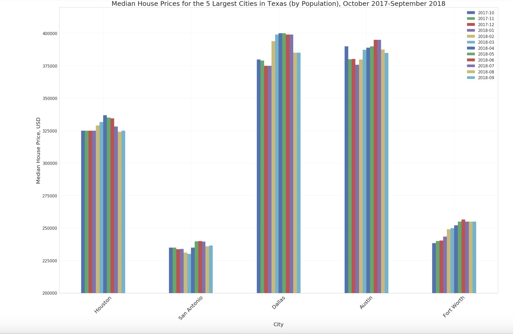

# Assignment 1 Peer Review

## Plot 1

## Plot 2

Two plots have been created to show the median house prices in five cities for the past one year. From the first plot it is easy to 
understand the changes in price for each city in the past 12 months. The quantities being visualized have been shown clearly. The colors
for the graph have been limited to 6 and the graphical elements have been chosen appropriately. From the second plot is easy to understand 
the changes in price for each city in the past 12 months as well as compare the prices between cities. The plot reproduces the information
visually. The first plot can be improved by starting the y –axis from zero and using horizontal bars.  
